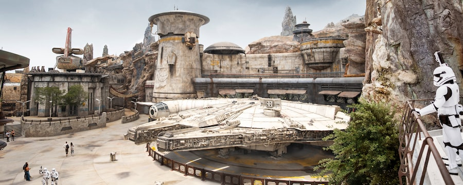

# Star Wars: Galaxy's Edge Experience Data Analysis

The goal of this analysis was to explore guest feedback about Star Wars: Galaxy's Edge and identify new competitive advantages in hidden patterns by better understanding fan beliefs, emotions, and sentiments. 

Star Wars is one of the highest-grossing media franchises of all time. Star Wars: Galaxy's Edge is one of the most ambitous and immersive experiences ever created and the largest themed areas at Disney Parks. It opened at Disneyland in Anaheim, California on May 31, 2019 and Hollywood Studios at Walt Disney World in Orlando, Florida on August 29, 2019. Each of these 2 themed areas cost an estimated $1 billion and feature over 14 acres of attractions, shops, and restaurants.

## Technology

* **Natural Language Toolkit (NLTK)** for sentiment analysis
* **scikit-learn** machine learning package for clustering social media data using the k-means algorithm
* **Seaborn** to visualize survey responses as both a correlation matrix and clustermap

## Data Type
There are 2 types of data: operational data and experience data. For this analysis, I used experience data.

### Operational Data
* Tangible records of tangible activities like sales (tickets, merchandise, concessions), finance and HR
* Data about the past
* Tells you what happened

### Experience Data
* Human feedback that points to the gaps between what you think is happening and what’s really happening
* Data about the future
* Tells you why it's happening

## Data Sources
For this analysis, I focused on experience data collected from:
* Online Survey
* Twitter
* Google Trends

## Online Survey Data
I created a survey using Google Forms and collected **165** responses from various Reddit subreddits including: 

* r/StarWars 
* r/WaltDisneyWorld 
* r/disneyparks 
* r/DisneyWorld 
* r/Disneybound 
* r/GalaxiesEdge 
* r/DisneyTravel 
* r/Disneyland

### Age Groups of Survey Participants
The pie chart visualizes the age groups of survey participants. **25-34** is the largest age group who participated in the survey followed by the adjacent age groups **18-24** and **35-44**. The 2 smallest participating age groups are the youngest (**Under 18**) and the oldest (**55-64**).

### Experience Ranking by Age Group
Survey participants were asked to rate **17** experiences at Star Wars: Galaxy's Edge by personal importance. The following visualizations show how important each experience is by age group.

### Correlations
The correlation matrix visualizes correlations between experiences. For example, there is a strong correlations (visualized as darker blue) between Savi's Workshop and Droid Depot.

The clustermap further groups experiences together by rearranging the experiences into clusters. Again we see the correlations between Savi's Workshop and Droid Depot and they are also clustered together by importance.

## Twitter Sentiment Analysis
I analyzed a dataset of **43,158** tweets using the hashtag #galaxysedge from 10/17/19 to 7/15/20 to determine overall sentiment of Star Wars: Galaxy's Edge. 

Visualization of the top **25** words in the dataset after text processing with the Natural Language Toolkit.

Visualization of the top **100** words in the dataset after text processing with the Natural Language Toolkit.

### Determining Sentiment
I used the Natural Language Toolkit to determine polarity scores. Polarity scores can then be used to determine sentiment using the scale **-1 (very negative)** to **1 (very positive)**:

* Polarity **greater than** 0 is **positive**
* Polarity **equal** to 0 is **neutral**
* Polarity **less than** 0 is **negative**

Overall Sentiment Scores:
* **47.5%** Positive
* **41.3%** Neurtal
* **11.2%** Negative

### Top 100 Words Used With Positive Sentiment

### Top 100 Words Used With Neutral Sentiment

### Top 100 Words Used With Negative Sentiment

## Clustering
To further analyze the processed text from the Twitter dataset, I used the k-means clustering algorithm. K-means clustering is a type of unsupervised learning used with unlabeled data. The goal of this algorithm is to group similar data points together and discover underlying patterns.

### Determining the Number of Clusters
The first step was determing the number of clusters for this dataset. To do this, I used the elbow method, visualized below, which shows that **3** is the optimal number of clusters.

The scatterplot visualizes the **3** clusters and their centroids (center of the cluster) of processed text from the Twitter dataset.

### Most Important Words
Each word in the processed dataset is given a tf-idf (term frequency-inverse document frequency) score that contextually ranks its importance. Below are visualizations of the words in each cluster with the highest mean tf-idf score.

#### Cluster 1

#### Cluster 2

#### Cluster 3

### Top Words
The visualization below show the top words in each cluster. This words can help determine hot topics during the timeframe of the dataset.

## Search Trends
Google Trends provides a way to measure public interest in a topic over a selected period of time. Google Trends doesn't tell you how many searches occured for a topic but it provides a popularity score from **0 to 100** that indicates interest:

* **100** - peak popularity for the term
* **50** - the term is half as popular
* **0** - not enough data for this term

Google Trends also provides information about search topics and queries related to the main topic you're researching.

### Interest Over Time

### Interest by State

## Findings

### Star Wars: Galaxy's Edge is Popular
* Star Wars: Galaxy's Edge has had a very positive reception on Twitter with **88.8%** of Tweets being either positive or neutral and only **11.2%** of Tweets classified as negative.

### Rides Are Most Important - Especially Star Wars: Rise of the Resistance
* The survey data shows that all age groups rank the rides as the most important experiences.
* Star Wars: Rise of the Resistance is rated the most important ride followed by Millennium Falcon: Smugglers Run.
* The sentiment analysis identified the words 'resistance' and 'rise' as the the **#2** and **#3** most used words while 'falcon' and 'millennium' were ranked **#14** and **#24** respectfully. Perhaps this is an indication that guests prefer a passive dark ride rather than an interactive experience.
* The top words identified in 1 of the 3 k-means clusters were 'resistance', 'rise', and 'ride'.

### After Rides, Oga's Cantina is the Most Important Experience for Ages 18-24 and 35-44
* After the rides, the survey data revealed that the 3 largest participating age groups ranging from **18-44** years old rank Oga's Cantina as the next most important experience.
* 'Cantina' was a top word identified in 2 of the 3 k-means clusters.
* After the rides, the survey data revealed that both the youngest (**Under 18**) and oldest (**55-64**) participants prioritize shopping as most important.

### Savi's Workshop is An Important Experience
* Savi's Workshop is the top shopping experience for **45-54**.
* Savi's Workshop and Droid Depot are tied for top shopping experience for **Under 18**.
* Savis's Workshop and Dok-Ondar's Den of Antiquities are tied for top shopping experience for **25-34** and **35-44**.
* Savis Workshop, Droid Depot, Dok-Ondar's Den of Antiquities, Black Spire Outfitters, and Toydarian Toymaker are all tied for top shopping experience for **55-64**.
* The popularity of Savi's Workshop can also be seen in the sentiment analysis as 'lightsaber' shows up as the **#10** most used word ranked above words referencing Millennium Falcon: Smugglers Run, Droid Depot and Oga's Cantina.

### Correlations Between Savi's Workshop and Droid Depot
* Based on the correlation matrix, there is a strong correlation in interest between Savi's Workshop and Droid Depot. This means that people who visit one of these shopping experience are highly likely to visit the other.
* The sentiment analysis shows that the word 'droid' ranks just ahead of 'cantina'.
* Top words identified in 2 of the 3 k-means clusters were 'lightsaber', and 'droid'.
* Google Trends data for Star Wars: Galaxy's Edge shows that of the most relevant top 25 related search topics, 'Lightsaber' is **#2**, 'Droid' is **#6**, 'Workshop' is **#10**, 'Saber' is **#11**, and 'Cantina' is **#12**.
