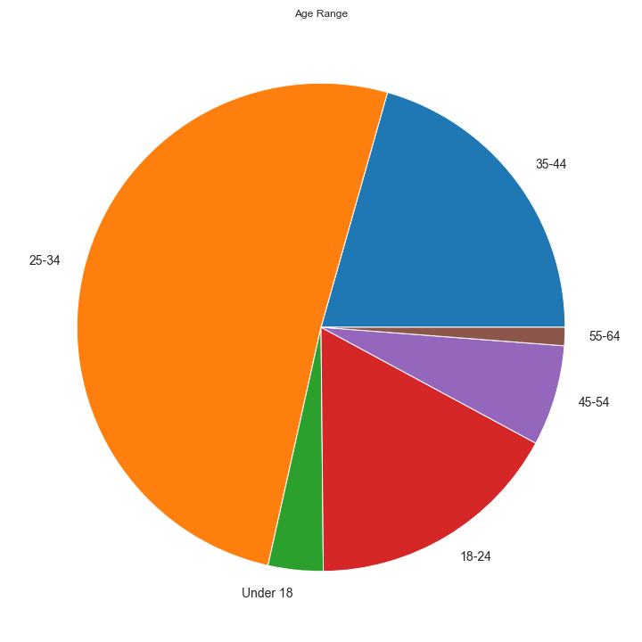

# Star Wars: Galaxy's Edge Experience Data Analysis
The goal of this project was to analyze guest feedback (i.e. beliefs, emotions, and sentiments) about Star Wars: Galaxy's Edge and identify new competitive advantages in hidden patterns by better understanding the fans.

Star Wars: Galaxy's Edge is one of the most ambitous and immersive themed experiences ever created. It opened at Disneyland in Anaheim, California on May 31, 2019 and Hollywood Studios at Walt Disney World in Orlando, Florida on August 29, 2019. Each of these 2 themed areas cost an estimated $1 billion and feature over 14 acres of attractions, shops, and restaurants.

## Data Sources
There are 2 types of data: operational data and experience data. 

### Operational Data
* Tangible records of tangible activities like sales (tickets, merchandise, concessions), finance and HR
* Data about the past
* Tells you what happened

### Experience Data
* Human feedback that points to the gaps between what you think is happening and what’s really happening
* Data about the future
* Tells you why it's happening

For this analysis, I focused on experience data collected from:
* Online Survey
* Twitter
* Google Trends

## Online Survey Data
I created a survey using Google Forms and collected 165 responses from various Reddit subreddits including: 

* r/StarWars 
* r/WaltDisneyWorld 
* r/disneyparks 
* r/DisneyWorld 
* r/Disneybound 
* r/GalaxiesEdge 
* r/DisneyTravel 
* r/Disneyland

### Age Groups of Survey Participants
Below is a pie chart that visualizes survey participation by age group. Ages 25-34 represent the largest age group who participated in the survey. The next 2 largest age groups are the adjacent youngest and oldest age groups making the largest representation 18-44. The smallest participating age groups are the youngest (18 and under) and the oldest (65 plus).

### Experience Ranking by Age Group
Below you'll see the ranked importance of each experience by age group.

### Correlations
Below are the correlations

## Sentiment Analysis

## Clustering

## Search Trends

