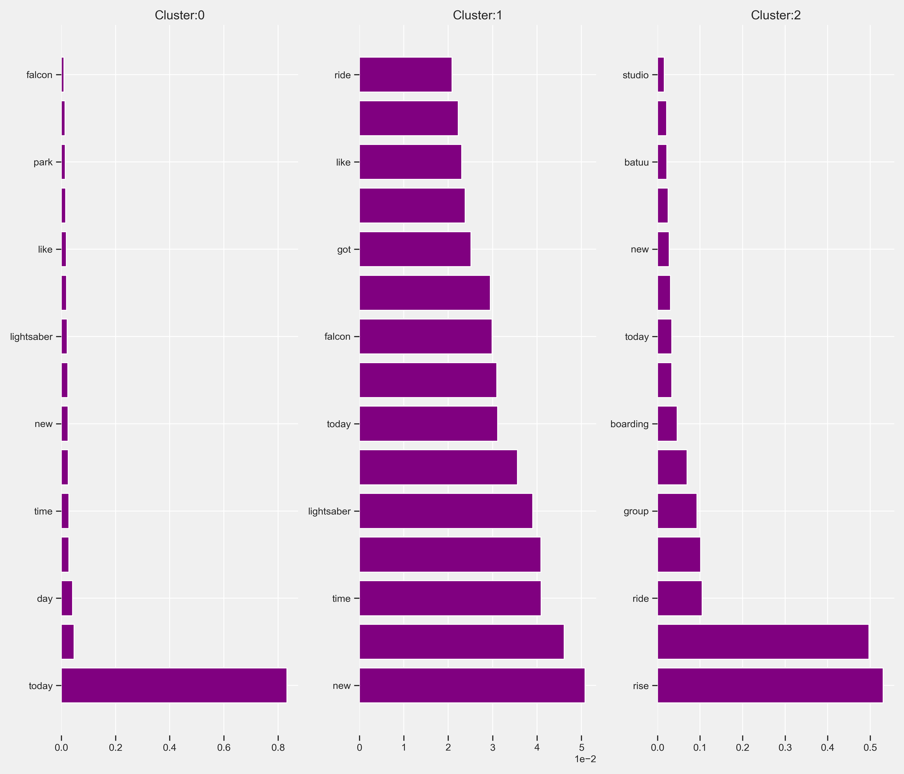

# Star Wars: Galaxy's Edge Experience Data Analysis
The goal of this analysis was to explore guest feedback about Star Wars: Galaxy's Edge and identify new competitive advantages in hidden patterns by better understanding fan beliefs, emotions, and sentiments.

Star Wars is one of the highest-grossing media franchises of all time. Star Wars: Galaxy's Edge is one of the most ambitous and immersive experiences ever created and the largest themed areas at Disney Parks. It opened at Disneyland in Anaheim, California on May 31, 2019 and Hollywood Studios at Walt Disney World in Orlando, Florida on August 29, 2019. Each of these 2 themed areas cost an estimated $1 billion and feature over 14 acres of attractions, shops, and restaurants.

## Data Type
There are 2 types of data: operational data and experience data. For this analysis, I used experience data.

### Operational Data
* Tangible records of tangible activities like sales (tickets, merchandise, concessions), finance and HR
* Data about the past
* Tells you what happened

### Experience Data
* Human feedback that points to the gaps between what you think is happening and what’s really happening
* Data about the future
* Tells you why it's happening

## Data Sources
For this analysis, I focused on experience data collected from:
* Online Survey
* Twitter
* Google Trends

## Online Survey Data
I created a survey using Google Forms and collected 165 responses from various Reddit subreddits including: 

* r/StarWars 
* r/WaltDisneyWorld 
* r/disneyparks 
* r/DisneyWorld 
* r/Disneybound 
* r/GalaxiesEdge 
* r/DisneyTravel 
* r/Disneyland

### Age Groups of Survey Participants
The pie chart visualizes the age groups of survey participants. 25-34 is the largest age group who participated in the survey followed by the adjacent age groups 18-24 and 35-44. The 2 smallest participating age groups are the youngest (Under 18) and the oldest (55-64).

### Experience Ranking by Age Group
Survey participants were asked to rate 17 experiences at Star Wars: Galaxy's Edge by personal importance. The following visualizations show how important each experience is by age group.

### Correlations
The correlation matrix visualizes correlations between experiences. For example, there is a strong correlations (visualized as darker blue) between Savi's Workshop and Droid Depot.

The clustermap further groups experiences together by rearranging the experiences into clusters. Again we see the correlations between Savi's Workshop and Droid Depot and they are also clustered together by importance.

## Twitter Sentiment Analysis
I analyzed a dataset of 43,158 tweets using the hashtag #galaxysedge from 10/17/19 to 7/15/20 to determine overall sentiment of Star Wars: Galaxy's Edge. 

Visualization of the top 25 words in the dataset after text processing with the Natural Language Toolkit.

Visualization of the top 100 words in the dataset after text processing with the Natural Language Toolkit.

### Determining Sentiment
I used the Natural Language Toolkit to determine polarity scores. Polarity scores can then be used to determine sentiment using the following scale:

* Polarity greater than 0 is positive
* Polarity equal to 0 is neutral
* Polarity less than 0 is negative

Overall Sentiment Scores:
* 47.5% Positive
* 41.3% Neurtal
* 11.2% Negative

### Top 100 Words Used With Positive Sentiment

### Top 100 Words Used With Neutral Sentiment

### Top 100 Words Used With Negative Sentiment

## Clustering
To further analyze the processed text from the Twitter dataset, I used the k-means clustering algorithm with the scikit-learn machine learning library. K-means clustering is a type of unsupervised learning used with unlabeled data. The goal of this algorithm is to group similar data points together and discover underlying patterns.

### Determining the Number of Clusters
The first step was determing the number of clusters for this dataset. To do this, I used the elbow method, visualized below, which shows that 3 is the optimal number of clusters.

The scatterplot visualizes the 3 clusters and their centroids (center of the cluster) of processed text from the Twitter dataset.

### Most Important Words
Each word in the processed dataset is given a tf-idf (term frequency-inverse document frequency) score that contextually ranks its importance. Below are visualizations of the words in each cluster with the highest mean tf-idf score.

#### Cluster 1

#### Cluster 2

#### Cluster 3

### Top Words
The visualization below show the top words in each cluster. This words can help determine hot topics during the timeframe of the dataset.

## Search Trends
Google Trends provides a way to measure public interest in a topic over a selected period of time. Google Trends doesn't tell you how many searches occured for a topic but it provides a popularity score from 0 to 100 that indicates interest:

* 100 - peak popularity for the term
* 50 - the term is half as popular
* 0 - not enough data for this term

Google Trends also provides information about search topics and queries related to the main topic you're researching.

### Interest Over Time

### Interest by State

## Findings

---

* Look up related search terms from Google Trends

* Galaxy's Edge has had a very positive reception on Twitter with 88.8% of Tweets being either positive or neutral and only 11.2% of Tweets classified as negative.

* Below you'll see the ranked importance of each experience by age group. Across all age groups, the most important experiences are the rides with Rise of the Resistance as #1 and Smugglers Run as #2. After the attraction, the middle three age groups comprising 18-44 were most interested in Ogas Cantina after the attractions while both the youngest and oldest age groups were interested in the shopping experiences primarily Savis and Droid Depot. Den of Antiquities is a popular shopping location across all age groups. Den of Antiquties is like a souvenir shop meets museum.

* The attractions are the most important aspect and Rise of the Resistance was selected as the top aspect and is also promiment in the sentiment scores and top words used

* We see that Savis and Droid Depot are both of interest together.

* Lightsaber scored high

* After attractions, Ogas Cantina is most important for all ages groups accept 55-64 and Under 18. Those age groups listed shopping as the next priority - specifically Droid Depot and Savis.

* All age groups 18-44 accept youngest and oldest

* Look at total word count

* Den of Antiquities is an important shopping destination across all ages groups - cool collectibles and unique shopping - shop meets museum

* Correlation in Savis and Droid Depot because it's a customized gift

* Experience in word cloud - check other words like Lightsaber

* Most immersive to live in universe by paying money for either an experience or item that you choose

* Passive dark ride more popular

* Popularity of alcohol
